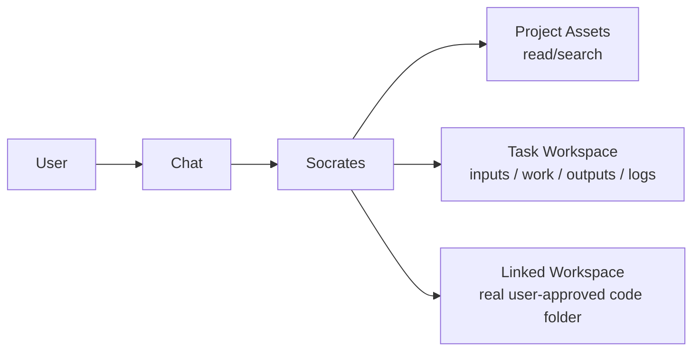

# Socrates

> A local-first coding agent with a real task workspace, real file editing, and real guardrails.

<p align="center">
  
  
  
  
</p>

Socrates is a chat-first, task-backed workspace agent. It can read uploaded resources, reason in chat, escalate into a structured task when real work is needed, and operate on a user-approved linked code workspace with explicit guardrails.

## Why Socrates

- Chat first, not task first. Simple questions stay simple.
- Real task workspaces with `inputs/`, `work/`, `outputs/`, and `logs/`.
- Real coding-agent tools: read, search, edit, patch, and execute commands.
- Real approval flow for risky commands and linked-workspace edits.
- Local-first persistence with SQLite plus filesystem-backed task state.

## Mental Model



Socrates works across 3 spaces:

| Space | What it is | What the agent can do |
| --- | --- | --- |
| `project` | Uploaded project resources | Read and search |
| `task` | Internal scratch workspace | Read, search, edit, patch, execute commands |
| `linked_workspace` | Real user-approved code folder | Read, search, edit, patch, execute commands with approval |

## Task Workspace Rules

Socrates does not get free-form filesystem access. The task workspace is structured and enforced:

| Folder | Purpose | Agent access |
| --- | --- | --- |
| `inputs/` | Query attachments and backend-managed task inputs | Read/search only |
| `work/` | Scripts, temp files, intermediate analysis | Read/search/edit/write |
| `outputs/` | Final deliverables | Read/search/edit/write |
| `logs/` | System-managed execution logs | Read/search only |

## Tool Surface

Socrates currently uses a 12-tool surface when command execution is available, or 11 tools when `execute_command` is unavailable:

1. `list_files`
2. `read_file`
3. `search_files`
4. `edit_file`
5. `write_file`
6. `apply_patch`
7. `execute_command`
8. `create_task`
9. `update_task_status`
10. `start_worker`
11. `write_project_note`
12. `get_system_time`

Worker runs use a separate worker-only todo surface:
- `update_current_todo_item`
- `skip_todo_item`

Write tools are intentionally focused:
- `edit_file` performs exact string replacement in one file.
- `write_file` creates or intentionally overwrites a whole file.
- `apply_patch` applies atomic exact-context patches across one or more files.

## Safety Model

- Chat mode is read-only except one small `write_project_note`.
- If real writing or command execution is needed, Socrates must create or resume a task.
- Task work follows the planner -> approval -> todo -> worker flow: Socrates writes the plan, the user approves or rejects it through the UI, Socrates creates the todo, and `start_worker` executes the approved work.
- Linked workspace commands require approval.
- Destructive system commands are hard-blocked.
- Raw host paths and internal IDs are not model-facing.
- Command execution uses the managed Socrates Python runtime and is Python-only in the current runtime stage.

## Quick Start

### Prerequisite

- Python 3.11+
- Node.js 20+

### Backend

Create an ignored `.env` or export the provider keys you want the backend to use, such as `GEMINI_API_KEY`, `OPENROUTER_API_KEY`, or `OPENAI_API_KEY`.

```bash
python -m venv venv
source venv/bin/activate
pip install -r backend/requirements.txt
uvicorn backend.src.app:app --host 127.0.0.1 --port 8000 --reload
```

On Windows, activate the virtual environment with:

```powershell
.\venv\Scripts\Activate.ps1
```

### Frontend

```bash
cd frontend
npm ci
npm run dev
```

Then open:

- App: `http://localhost:3000`
- API: `http://localhost:8000/api/v1`

## What Starts Automatically

- SQLite database
- backend migrations
- persistent local Socrates home at `~/.socrates`
- database at `~/.socrates/data/premchat.db`
- uploads at `~/.socrates/files/uploads`
- managed task workspaces under `~/.socrates/projects`
- one managed Socrates Python environment at `SOCRATES_PYTHON_VENV`
- logs and cache under `~/.socrates/logs` and `~/.socrates/cache`

Socrates works in its own `~/.socrates` home and in explicit absolute linked workspace paths that the user approves. The repository itself should not contain runtime data.

## What You Can Do

- upload PDFs, images, CSV/TSV, JSON, SQLite files, and code files
- ask questions directly in chat
- let Socrates escalate into a task for deeper analysis
- inspect and edit files in a linked code workspace
- run approved commands against a real workspace
- export task outputs back into project assets

## Local Development

### Backend

The backend defaults to `Path.home() / ".socrates"` on macOS, Windows, and Linux. Advanced development overrides such as `SOCRATES_HOME`, `APP_DATA_DIR`, `DATABASE_URL`, `UPLOADS_DIR`, `SOCRATES_PROJECTS_DIR`, and `SOCRATES_PYTHON_VENV` are supported, but the normal local app path is `~/.socrates`.

```bash
python -m venv venv
source venv/bin/activate
pip install -r backend/requirements.txt
uvicorn backend.src.app:app --reload
```

### Frontend

```bash
cd frontend
npm ci
npm run dev
```

Create `frontend/.env.local` with:

```bash
VITE_API_PROXY_TARGET=http://127.0.0.1:8000
```

The frontend proxies API traffic to the backend in development. Use `127.0.0.1` instead of `localhost` so the dev WebSocket target matches the backend IPv4 bind reliably on macOS.

## Project Docs

- [Memory](./MEMORY.md)
- [API Contracts](./CONTRACTS.md)
- [Database Structure](./dbstructure.md)

## Current Status

Socrates is already a real workspace coding agent:

- task-backed execution is live
- linked workspaces are live
- approval flow is live
- plan approval auto-resume is live
- worker handoff and live worker trace visibility are live
- read/search/edit/patch flow is live
- terminal task closure is live
- structured task artifacts and export flow are live

The remaining work is hardening and iteration, not basic capability creation.
