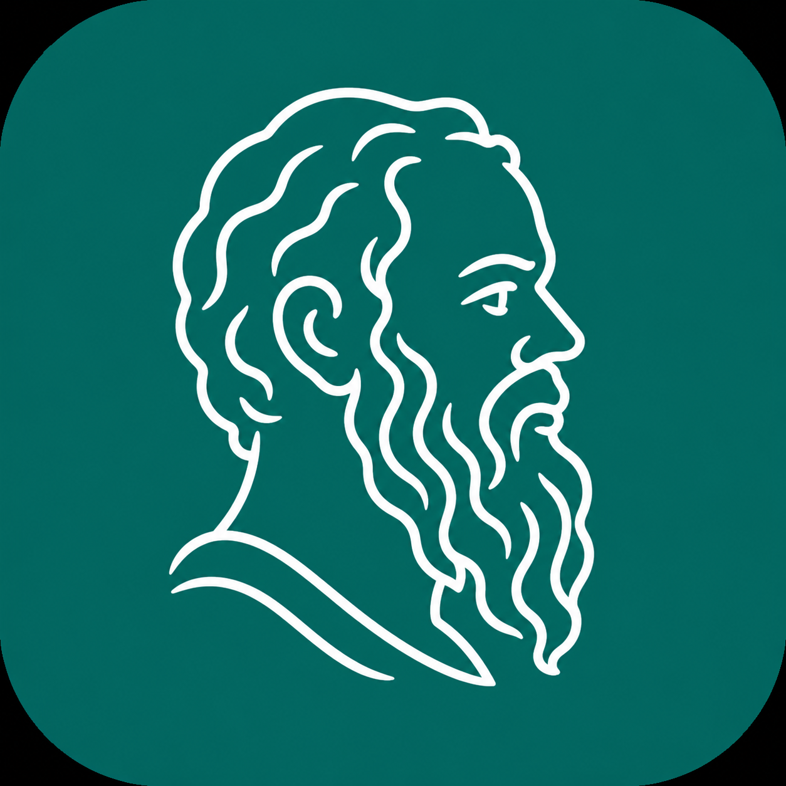

<p align="center">
  
</p>

<h1 align="center">Socrates</h1>

<p align="center">
  <strong>Your local-first AI co-pilot for real project work.</strong>
</p>

<p align="center">
  Local data. Real tools. Traceable results.
</p>

---

Socrates is a local-first coding and investigation workspace that keeps long project work coherent across turns. You can chat, run local tools, inspect evidence, and continue a large session without losing context.

## What Socrates Can Do

- Start work in the browser with one command.
- Maintain projects, conversations, and persistent session history.
- Run shell, search, patch, file, git, and workspace tools safely.
- Call AI models for coding, analysis, and planning in a provider-aware stack.
- Stream live tool use, output, errors, and assistant responses.
- Compress context for long sessions while preserving key details.
- Preserve context evidence with quote-friendly search and turn-aware trace retrieval.
- Keep a local SQLite trail of events, tools, messages, and run metadata.
- Download and run signed-free npm runtime bundles from GitHub Releases.

## Current Project State

- Runtime release milestone: **v0.1.19**.
- Distribution: `@socrates-ai/cli` launches the latest GitHub runtime via `npx`; launcher source is prepared at **0.1.19** for npm publish.
- Runtime availability for macOS 15+ (arm64/x64) and Windows x64.
- The original cream **Classic View (V1)** welcome, projects, and project dashboard remain the default path. A project-scoped **Go to Flow View** control opens that same project's isolated V2 Flow; there is no global view chooser or second project directory.
- Seamless View provides one persistent Flow per project, bounded foreground/parked goals, versioned capsules, pruned working context, and immutable retrievable evidence.
- Each Flow focus maps explicitly to one Classic conversation, so **Open in Classic** and **Continue in Flow View** preserve the same visible Q&A without merging the two runtimes.
- V2 inherits the same providers, Socrates agent, tools, approvals, Terminals, MCP servers, skills, Memory Router, Global Memory Agent, workspace `.socrates/`, and global `~/.Socrates/` foundation as Classic.
- The shared Classic composer now includes click-to-record STT. It defaults to local Whisper `small.en`, appends the transcript to the unsent draft, never auto-sends, and creates no V2 Flow state.
- V2 Voice V1 additionally exposes local Whisper `base.en`/`small.en`, the three allowlisted OpenRouter transcription models, and local Kokoro read-aloud; local failures never silently upload audio.
- Ollama can serve local chat models from the normal model picker when the local Ollama runtime is reachable.
- Trace retrieval upgraded for broader match windows and exact quote context.
- Duplicate tool-call handling added to avoid repeated identical retrieval passes in one turn.
- Context compression now uses a first-class structured `CompressorAgent`.
- Socrates now enforces repo-docs preflight before write/approval-required mutations and requires durable project memory closure after meaningful work.

## Quick Start

Install and run (no setup):

```bash
npx @socrates-ai/cli
```

Or install globally:

```bash
npm install -g @socrates-ai/cli
socrates
```

When testing the CLI from this repo, use the local bin directly:

```bash
node apps/cli/bin/socrates.mjs --version
```

## Local Development

Run the normal backend and web frontend directly. Native desktop/Tauri delivery has been discarded and is not a supported development or release path.

Terminal 1:

```bash
pnpm install
SOCRATES_V2_FLOW_ENABLED=true pnpm --filter @socrates/server dev
```

Terminal 2:

```bash
pnpm --filter web dev
```

Useful build targets:

```bash
pnpm runtime:build      # build the normal backend/frontend runtime
pnpm runtime:archive    # generate runtime zip
pnpm runtime:smoke      # verify packaged runtime retrieval dependencies
```

## Runtime Location

App data defaults to:

```text
~/.Socrates/socrates.sqlite
```

Use `SOCRATES_HOME` to point the workspace to a custom root or `SOCRATES_DB_PATH` for a specific SQLite file.

## Stack at a Glance

```text
apps/
  web/       Next.js interface, conversations, project views, settings
  server/    Fastify APIs, WebSockets, tool coordination, persistence

packages/
  core/      agent orchestration and context logic
  workspace/ local operations and tool adapters
  providers/ model integrations and token handling
  contracts/ schemas for events and tool contracts
  shared/    utility types and helpers
```

## Notes

- Node.js 20+ is required.
- Runtime downloads and app data are kept local.
- Provider credentials stay outside message/event payloads.
