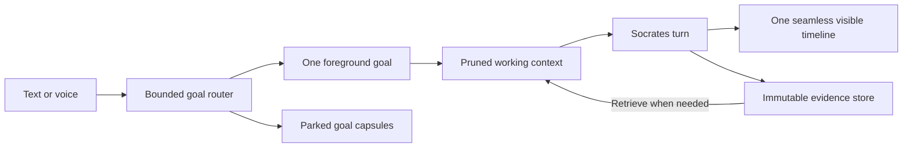

# Socrates V2 Flow Architecture

This document is the architecture authority for the experimental Socrates V2 Seamless Flow experience.

Status: the isolated first product cut is implemented behind the V2 boundary. Whole-workspace regression, production builds, normal runtime packaging, and a real browser E2E have passed. Formal accessibility automation, cross-platform release archives, full local speech-pack runs, and extended reliability validation remain; implementation does not mean that a 24-hour unattended soak has already passed.

## Absolute V1 And V2 Boundary

The boundary is non-negotiable until the user explicitly changes it.

### V1 Classic

V1 means the current project chat product and its current behavior:

- The existing chat window and project/conversation routes.
- The current `conversations`, `sessions`, `turns`, and `messages` model.
- The current Classic conversation persistence, Classic context policy, Classic agent-task/tool/Terminal audit rows, Classic retrieval semantics/scoping, voice-input/read-aloud records, and title behavior.
- Existing HTTP, WebSocket, persistence, replay, and frontend contracts.

V1 must remain behaviorally untouched by Flow orchestration while V2 is built. Do not retrofit V2 goals, Flow routing, capsules, context dispositions, self-pruning, automatic topic separation, V2 speech jobs/read-aloud, or other V2 persistence into V1. Existing V1 conversations must not be migrated, reinterpreted, or silently written into V2 state. The explicitly approved shared composer microphone is a bounded exception: Classic may transcribe temporary conversation audio into its unsent draft, but that path creates no V2 goal, artifact, job, event, or Flow state.

### V2 Flow

V2 is a separate experimental product surface and execution path:

- A separate V2 window or mode in the UI.
- One persistent visible Flow per project.
- Backend-managed goals inside that Flow.
- One foreground goal at execution time and compact parked goal capsules.
- A goal-aware, self-pruning model context backed by immutable evidence.
- Text and voice as equivalent ways to enter the same Flow.
- V2-namespaced contracts, persistence, events, services, and tests.
- A source-server feature flag that is off unless `SOCRATES_V2_FLOW_ENABLED=true`, plus an ordinary packaged NPM/runtime launcher that defaults the flag to `true` for the normal product.

`GET /api/v2/capabilities` remains mounted so the UI can report availability. When V2 is off, the Flow/speech HTTP routes and `/v2/ws` are not mounted, and V1 goal/routing/persistence behavior remains identical to Classic. Direct source-server development must set `SOCRATES_V2_FLOW_ENABLED=true`; the ordinary `scripts/runtime/launcher.mjs` passes the explicit environment value or defaults it to `true`, so the normal packaged web/backend product exposes the project-scoped **Go to Flow View** action. Classic's separate conversation-scoped STT route is intentionally available independently of that feature flag and still creates no V2 state.

### Allowed Shared Foundation

V2 may reuse stable low-level infrastructure:

- Provider adapters and model catalog resolution.
- Hosted model and Ollama chat support.
- Embedding providers, LanceDB indexing, and retrieval algorithms.
- Workspace tools, file handling, artifacts, approvals, and Terminal execution.
- Agent runner primitives, structured-output validation, usage accounting, and error normalization.
- The same Socrates agent behavior and model-visible tool set.
- Workspace `.socrates/` project memory, notes, repo docs, resources, attachments, and project skills.
- Global `~/.Socrates/` identity, user profile, tool docs, provider credentials/settings, global skills, and MCP configuration.
- The same Memory Router implementation and background Global Memory Agent, with V2 source adapters and V2-owned telemetry.
- The accepted V2 Voice V1 speech engines: local Whisper, the three-model OpenRouter transcription allowlist, and local Kokoro-82M.

The rule is:

```text
reuse plumbing
do not reuse V1 orchestration policy as V2 policy
```

V2 must not achieve reuse by inserting V2 routing or context behavior into the V1 turn path. It should call shared capabilities from an explicitly V2-owned orchestration layer.

The older `V2 Provider Plan` wording in `PROVIDER_USAGE.md` referred to a later provider-adapter roadmap. It is not the V2 Flow product. Provider documentation must use unambiguous wording so the two ideas cannot be confused.

### Implemented Inheritance Map

The user-facing phrase "V2 inherits V1" means capability inheritance, not Classic conversation-state inheritance.

```text
shared by Classic and Seamless
  SocratesAgent and operating prompt
  provider/model catalog, credentials, Ollama, embeddings
  workspace tools and mutation locks
  approvals and Terminal supervisor primitives
  MCP registry and dynamic tools
  project/global skills, including Agent Skill ZIP import
  .socrates memory, notes, repo docs, resources, attachments
  ~/.Socrates identity, user profile, tool docs, settings
  Memory Router implementation and Global Memory Agent

owned only by Seamless
  persistent Flow and goals
  bounded Goal Router and goal-message links
  deterministic goal titles and versioned capsules
  goal-aware context projection and evidence dispositions around shared Socrates
  v2.* contracts/events and /api/v2/* plus /v2/ws
  v2_* turns, tools, approvals, Terminals, evidence, usage, speech, recovery
```

V2 passes Flow/turn ids into shared runner primitives only as scoped runtime handles. Ordinary V2 execution never creates Classic model-call, tool-call, approval, evidence, usage, or event rows. The explicit bridge may create one Classic conversation/session per focus and idempotently mirror only visible completed Q&A; it never treats those bridge rows as V2 runtime ownership. Shared memory notes carry `sourceRuntime: "v2_flow"` and exact Flow/turn/message coordinates, and background memory processing must not append a Classic event for that source.

The Global Memory Agent is one application-level learner across both experiences. Its manifest includes unprocessed completed V2 turns with project/Flow/goal labels, it resolves their Q&A and raw evidence through the shared retrieval facade, and a completed shared Memory Agent job records the processed V2 turn ids in its evidence receipt. V2 does not fork profile, identity, memory-agent journal, or skill-learning state merely to preserve conversation isolation.

V2 uses the same Memory Router behavior around Socrates turns, but its routing attempts, errors, and usage are persisted in V2 telemetry. The V2 Goal Router is an additional, separate bounded router above the turn. Classic and Flow are two views of the same Socrates runtime: both use the same Context Compactor worker and the exact shared 170k trigger, 120k acceptance ceiling, and 180k hard pre-provider limit. Selected-model context-window metadata must not create a V2-only compaction policy.

V2 does not invoke the Classic conversation-title rewriter and does not make a separate capsule-writing model call. New goal titles and rich capsule snapshots are derived deterministically from authoritative V2 state, and capsule versions provide the resumable semantic label/state. The Goal Router uses its own configurable `goal_router` worker selection and calls its strict V2 routing schema through the shared structured-agent runner rather than the Classic title-rewrite service.

## Product North Star

The user should not have to manage chat boundaries.

From the user's perspective, a project has one calm, never-ending conversation surface. The user can type or speak naturally, change subjects, return to old work, and introduce several ideas without deciding when to create a new chat. Socrates organizes that stream on the backend.

The visible experience is one timeline. The backend is not one ever-growing prompt. It continuously selects the current goal, parks other goals as compact capsules, assembles only relevant working context, and preserves exact evidence outside the active model request.

The central design is:



This is the main V2 architecture pointer.

## Canonical Structure

```text
Project
  └── one persistent V2 Flow
        ├── Goal A
        │     ├── linked visible messages and turns
        │     ├── context-item decisions
        │     └── immutable capsule versions
        ├── Goal B
        └── Goal C
```

A Flow is not a browser visit, an app-open session, or the period between sitting down and walking away. It is the persistent V2 conversation timeline for one project. Closing the browser, restarting the app, or returning tomorrow does not create a new Flow.

A goal is the semantic unit of work inside that Flow. A goal can last one message or many days. Switching away parks it; returning resumes it. Goal boundaries are backend organization, not separate user-created chats.

## Core Concepts

### Flow

The one persistent V2 timeline owned by a project.

The Flow owns:

- Chronological visible messages.
- V2 turns and their runtime status.
- The current foreground goal.
- Parked, completed, blocked, and merged goals.
- Goal-routing history.
- Context-item state and immutable evidence references.
- V2 voice-input and read-aloud history.

The first version should enforce at most one active Flow per project. A later product decision may allow archived or alternate flows, but users should not need to create them during normal use.

### Goal

A bounded user objective or conversational thread inside a Flow.

Examples:

- General conversation.
- Diagnose a failing build.
- Plan the V2 database.
- Revisit a previous design question.
- Compare local speech engines.

A light greeting may create or continue a general-conversation goal. A goal should not be created for every sentence, and a topic change should not automatically destroy the previous goal.

The implemented schema states are:

```text
foreground
parked
blocked
completed
archived
```

The first cut creates, continues, parks, resumes, completes, reopens, and archives goals. The UI exposes switch, pause, finish, reopen, archive, pin, and unpin. Socrates itself may update the active focus summary, record a blocker, or stage completion through `focus_ledger`; staged completion commits only after the assistant answer is saved. General Conversation is protected from completion/archive, and unpinned parked work is safely auto-archived after seven inactive days. Destructive merge remains outside the first cut.

### Turn

One user input and the complete Socrates lifecycle needed to respond. Voice transcription produces the same kind of V2 turn as typed text.

One V2 turn has one foreground execution goal even when the user message mentions several goals. Secondary goal associations remain links for later routing and recall; they are not all loaded as simultaneous full contexts.

### Goal Message Link

A many-to-many association between a visible V2 message and one or more goals.

It records whether the message is:

- The primary message for the foreground goal.
- Relevant to a secondary goal.
- The message that created, resumed, completed, or redirected a goal.

This is important for users who naturally discuss many things at once. The system may preserve 20 or 30 durable goals without placing 20 or 30 full goal histories into one model request.

### Goal Capsule

A compact, versioned representation of a goal's working state. It is not the goal itself and it never replaces raw evidence.

A capsule is sufficient to decide whether a parked goal is relevant and to resume it safely. The implemented deterministic snapshot can contain:

- Goal title and objective.
- Current understanding.
- Decisions and user constraints.
- Completed work.
- Open loops, blockers, and unresolved questions.
- Next useful action.
- Relevant files, artifacts, and human-readable evidence anchors.
- Relevant Terminal or durable agent-task state.
- The reason and turn that produced this capsule version.

Capsules are immutable versions. Updating a capsule creates a new version and keeps the old version for audit. A goal points to its latest active capsule.

Capsule refresh is materiality-gated and deterministic. The current runtime evaluates refresh at initial creation and material turn completion, and refreshes at explicit park, resume, Terminal wait, failure, and cancellation boundaries. It never spends a `capsule_writer` or Classic `title_generator` model call, and it does not rewrite a capsule after every trivial turn.

### Immutable Evidence

The exact durable source behind Socrates' reasoning:

- PDF pages and extracted chunks.
- File reads and snapshots.
- Tool results.
- Terminal output ranges.
- Retrieved Q&A turns.
- User attachments and exact instructions.
- Errors, patches, artifacts, and model-visible source data.

Pruning never deletes this evidence. Raw evidence remains recoverable from durable storage and retains provenance, integrity hashes or equivalent identity, project scope, source kind, and creation time.

### Context Item

A model-context representation linked to one or more immutable evidence sources. It is the unit that V2 can keep exact, distill, release, or hold unresolved.

A context item is not necessarily one whole tool result. It may represent one page, one result chunk, an exact excerpt, a distilled brief, a goal capsule, or a recent visible exchange.

### Routing Run

The auditable result of the Goal Router. The model-facing contract stays deliberately small: `action`, numbered `candidates`, and a new human-facing `title` only when creation is selected. The backend resolves ids, generates any clarification copy, and records runtime effects without asking the model for confidence, rationale, secondary links, or hidden chain-of-thought.

## Bounded Goal Router

The router decides how each new text or voice message relates to the existing Flow.

Its implemented action vocabulary stays small:

```text
use one numbered existing goal
create one new goal with a short human title
ask one bounded clarification between real numbered candidates
```

The Goal Router Agent receives the foreground goal plus at most five goals narrowed by the shared goal-card retrieval index, a short recent-turn window, and any explicit clarification answer. Its dedicated `goal_router` worker setting controls model and thinking, it has an eight-second bounded timeout, validates the strict Zod contract with one bounded repair attempt, and uses only a structural fallback when the provider fails, times out, or remains invalid: continue the current goal when one exists, otherwise create. There is no keyword, regex, or phrase-matching topic router. Its production prompt lives under `packages/core/src/prompts`, it runs through the shared structured-agent runner with an explicitly empty tool registry/executor mapping, and its model attempt, usage, errors, and routing effects persist through typed telemetry. Goal merging is not performed.

### Router Inputs

The router should receive only bounded metadata:

- The new user message or final voice transcript.
- The current foreground goal header and latest capsule.
- A short recent-turn window.
- A small retrieved set of likely parked-goal headers or capsules.
- Project identity and stable routing rules.

It must not receive every full goal history. Retrieval should narrow candidates before full capsule loading.

### Router Output

The backend needs enough structured output to:

- Select exactly one foreground goal for execution.
- Create or resume that goal.
- Attach one exact turn/message goal link.
- Park the previous foreground goal when appropriate.
- Persist an auditable routing result and backend-owned lifecycle effects.
- Ask one short clarification only when at least two real candidate goals remain genuinely plausible and choosing incorrectly would materially matter.

Clarification is same-turn routing, not a new user task: the original user request remains durable, the router question is a typed `routing_clarification` message, attachments are held, and the answer resolves the existing routing run before Socrates executes the original request. Ordinary ambiguity inside one focus does not trigger the router clarifier.

### ADHD And Many-Topic Behavior

The durable number of goals may be large. The active cognitive set must remain small.

V2 should use:

```text
one foreground goal
a bounded set of lightweight candidate goal headers
parked capsules on demand
all other goals absent from the current model request
```

If one message contains many unrelated requests, the first version chooses one foreground objective and either answers the bounded set sequentially or asks one natural clarification when execution order materially matters. It does not ask the router to manufacture secondary links or spawn dozens of full active contexts.

## Self-Pruning Working Context

Self-pruning means removing an expensive representation from the next LLM request. It never means deleting the underlying source.

After Socrates has inspected a substantial tool or retrieval result, the result receives one disposition:

| Disposition | Meaning in the next model request | Evidence behavior |
| --- | --- | --- |
| `keep_exact` | Keep the selected exact content active. | Raw source remains immutable. |
| `distill` | Replace the expensive active copy with a focused, attributed brief. | Raw source and the distillation both remain. |
| `release` | Remove it from active context. | Raw source remains retrievable. |
| `unresolved` | Keep it provisionally because its value cannot yet be judged. | Raw source remains and the item receives a mandatory review deadline. |

The implemented path is owned by the shared `SocratesAgent` loop used by Classic and Flow. Substantial successful tool outputs receive compact handles only after the main model has inspected their exact content. When Socrates needs another functional tool, it calls `context_disposition` in the same parallel response and chooses `keep_exact`, `distill`, `release`, or `unresolved`. There is no separate Context Distiller request and no post-turn disposition worker. Tiny outputs need no ceremony, and a final answer needs no disposition because intermediate tool results are not carried into the next visible conversation turn.

Conversation compaction before provider calls and post-turn precomputation both run through the same core `SocratesAgent.precomputeContext`/`CompressorAgent` path used by Classic, with the configured `socrates_context_compactor` model selection and shared fixed thresholds. The selected foreground model's advertised context window is telemetry and compatibility metadata only. Flow persists exact tool evidence for audit/retrieval with `includeInContext = false`; it does not automatically project old exact or distilled evidence into later turns.

### Distillation Contract

Main Socrates does the following in its ordinary tool loop:

- Receive exact evidence references, not a contextless copy with lost provenance.
- Receive a narrow question such as "retain the clauses relevant to termination liability."
- Produce a bounded structured brief with source anchors.
- Separate direct source facts from inference.
- Preserve exact quotations only when required and within source limits.
- Record exact provider/tool evidence and the typed control result for audit.
- Never delete or overwrite source evidence.

The control input is deliberately small: result handle, action, and an optional summary required only for `distill`. The stable tool schema is shared across providers and avoids changing the provider cache prefix between calls.

### Unresolved Guardrails

`unresolved` keeps the exact result visible only within the current turn so the next functional result can clarify its value. It is never a cross-turn parking state. The shared 170k compactor and hard pre-provider ceiling remain the bounded fallback if Socrates retains too much exact evidence in one turn.

### Mandatory Safety Rules

- The current user request and explicit constraints cannot be silently released.
- Active approvals, blockers, incomplete writes, and Terminal input requirements must survive context rebuilding.
- Exact code, errors, commands, paths, legal clauses, rubrics, or source-of-truth text remain exact when precision is material.
- A distillation is not evidence and must link back to evidence.
- Released evidence must remain retrievable without reconstructing it from the summary.
- Pruning decisions and their reasons are auditable, but private chain-of-thought is not persisted.
- Cross-project evidence must never enter a Flow unless an existing explicitly global memory surface allows it.

## Multi-Level Context Management

V2 should not wait for one enormous transcript compaction. It should manage context at several levels.

### Level 1: Tool-Output Disposition

After a substantial read, search, retrieval, or Terminal result has been consumed, retain only the exact portions still needed, distill the useful remainder, release noise, and deadline unresolved items.

Example:

```text
read 20 PDF pages
  -> keep 2 exact pages containing controlling clauses
  -> distill 3 pages relevant to the current question
  -> release 15 irrelevant pages from active context
  -> retain all 20 pages in immutable evidence storage
```

For ranked retrieval:

```text
receive 6 chunks
  -> keep the 2 decisive chunks
  -> distill one supporting chunk if useful
  -> release the remaining active copies
  -> preserve all retrieval provenance
```

### Level 2: Goal Working-Set Review

When the foreground goal changes or its working set grows, rebuild context from its recent linked turns, capsule, active items, and relevant evidence. Do not carry unrelated Q&A pairs merely because they are adjacent in the visible Flow.

### Level 3: Goal Capsule Compaction

When a goal is parked or a large phase finishes, create a new capsule version. Future routing can use the capsule before deciding whether exact goal evidence must be retrieved.

### Level 4: Flow-Level Working-Set Review

Flow may select goal-relevant evidence and omit unrelated goals, but it must not invent a separate percentage-based conversation-pressure policy. The full active-goal Q&A history is handed to the shared Socrates runner. The same fixed policy used by Classic then compacts at 170k estimated model-visible input, accepts a compacted request only at or below 120k, and enforces the 180k hard pre-provider ceiling.

The review should ask:

- Which visible Q&A pairs are unrelated to the foreground goal?
- Which exact items are still operationally necessary?
- Which items can be represented by capsules or distillations?
- Which old goal material should be fully absent from the next request?
- Which evidence needs a retrieval anchor rather than active bytes?

The correct result is a newly assembled goal-aware request, not a vague summary of the entire Flow.

### Level 5: Shared Socrates Provider-Boundary Compression

The shared Socrates compactor protects the provider boundary in both views. Flow uses a V2 persistence adapter so its snapshots, model calls, errors, usage, and immutable summary evidence remain namespaced, but the agent, compressor prompt/schema, worker setting, 170k trigger, rebuilt-request targets, and 180k hard ceiling are exactly the Classic Socrates policy.

## Context Assembly For A V2 Turn

The next Socrates request should be rebuilt, not appended forever.

Conceptual order:

```text
stable Socrates operating kernel and allowed shared rules
project identity and explicitly relevant project memory
foreground goal header and latest capsule
recent exact messages linked to the foreground goal
selected exact context items
selected attributed distillations
retrieved evidence requested for this turn
live Terminal, task, approval, and blocker state
new user message
current-turn tool calls/results as they occur
```

Parked goal histories, unrelated visible messages, released context items, and complete old tool dumps are absent unless retrieved.

The visible UI can still render the entire Flow because UI history and model context are different products.

### Retrieval Status In The First Cut

Exact retrieval has two implemented paths:

- `POST .../evidence/retrieve` and context assembly recover immutable V2 evidence by exact id/handle.
- The model-visible `trace_retrieve` searches and inspects exact V2 user/assistant Flow turns without creating Classic trace rows.

Completed, failed, and cancelled Flow turns are canonicalized into the shared per-project LanceDB corpus as role-separated Q&A parents with `runtimeKind = "v2_flow"` and exact `flowId` filtering. Lexical, semantic, and combined V2 searches therefore reuse the same chunking, embeddings, ranking, rebuild, and diagnostic lifecycle as Classic without creating fake Classic conversations. Queryless recall, exact inspect, and audit use a V2-owned raw adapter over messages, tool calls, Terminal chunks, immutable evidence, and errors; those authoritative records are not stuffed into the normal semantic Q&A corpus. Durable Terminal continuation turns inherit their task's root user request in canonical and global exact trace results. Explicit user deletion can remove one completed exchange or one non-General focus and its linked Classic projection. The backend then rebuilds project retrieval; workspace files and saved memory remain unchanged.

## Voice In V2

Voice is an input/output surface over the same Flow, not a separate agent or conversation type.

### Voice Input

```text
capture audio
  -> transcribe
  -> show/finalize transcript
  -> route transcript through the same bounded Goal Router
  -> create a normal V2 user message and turn
```

The goal router should operate on finalized text. Provider-specific partial transcripts may be displayed, but they should not create durable goals until the user submits or the transcript is finalized.

### Accepted V2 Voice V1 STT Stack

`V2 Voice V1` means the first speech-job/read-aloud slice inside experimental V2 Flow. Classic shares the push-to-talk composer affordance, lower-level transcriber adapters, and the explicit global selection, which defaults to **Not configured**. Classic appends the transcript to its unsent draft, deletes the temporary WAV, and creates no V2 speech state. Flow alone owns speech artifacts/jobs, Goal Router entry, and Kokoro read-aloud. Offline models download only after an explicit size-labelled Install action.

The accepted speech-to-text choices are deliberately narrow:

```text
local_whisper
  recommended model: small.en
  optional lightweight model: base.en
  execution: dedicated local Whisper runtime

openrouter
  nvidia/parakeet-tdt-0.6b-v3
  microsoft/mai-transcribe-1.5
  mistralai/voxtral-mini-transcribe
```

The packaged `local_whisper` runtime is the exact-pinned MIT-licensed `@fugood/whisper.node@1.0.22` N-API binding over MIT-licensed `whisper.cpp`. Its CPU native packages cover macOS arm64/x64, Linux arm64/x64, and Windows arm64/x64; the published macOS packages require macOS 15 or newer, and macOS arm64 may use Metal through the same binding. Runtime builds assert that the host-specific native addon survived `pnpm deploy` and load it with the bundled Node executable before producing the normal server/CLI runtime. The GGML `base.en` and `small.en` weights remain explicit checksum-verified model-pack installs rather than inflating the application bundle.

The real packaging check transcribed the reference JFK WAV with a checksum-verified `base.en` pack under both the host runtime and bundled Node. On the tested M3 Mac, the first native model/Metal initialization took roughly 19-20 seconds. That is a cold-start caveat and platform-specific observation, not a universal latency guarantee; the local timeout remains deliberately larger.

The native Node binding is the default local implementation. `SOCRATES_WHISPER_CPP_BINARY` remains an explicit operator override for a compatible `whisper-cli`, and the conventional packaged CLI location remains a recovery fallback if the native addon cannot load. Both paths preserve the same `local_whisper` engine/model contract. A native or CLI failure stays local and must never trigger an OpenRouter upload.

OpenRouter model discovery may refresh current availability, pricing, and capability metadata, but the initial V2 UI must filter the result to those three accepted model ids. Adding another hosted transcriber is an explicit product change, not an automatic consequence of it appearing in OpenRouter's catalog.

Granite Speech and Ollama-hosted audio models are not part of V2 Voice V1. A local Whisper failure must remain local: Socrates must never upload recorded audio to OpenRouter unless the user explicitly selected or approved the hosted route. The STT selection is independent from the chat and embedding provider.

### Read Aloud

The first useful version is one-off text-to-speech for an assistant response or selected response segment:

```text
assistant response
  -> user requests read aloud, or voice mode requests playback
  -> one TTS generation/playback job
  -> persisted V2 audio metadata and optional artifact
```

It does not need a continuous full-duplex realtime voice model. Realtime interruption and barge-in can be evaluated later.

V2 Voice V1 uses Kokoro-82M through exact-pinned `sherpa-onnx-node@1.13.4` as its only TTS engine. The native Node runtime is preferred and cached lazily; a compatible `sherpa-onnx-offline-tts` binary is a recovery fallback. Generation and playback stay local. The initial slice does not expose OpenRouter TTS, voice cloning, or a separate speech-writing agent. It reads the completed assistant text directly; an optional separately persisted `spokenText` rendition may be evaluated later.

The speech runtime may be distributed with Socrates, while Whisper and Kokoro model packs require an explicit user-initiated install with integrity verification. Once installed, the local path must work offline. Read-aloud remains opt-in per response by default and should not keep the model resident when it is idle.

### Local Speech And Ollama

Ollama is the local chat and embedding runtime. It is not the V2 Voice V1 STT or TTS engine. Local Whisper and local Kokoro use their own replaceable adapters, while hosted transcription uses the OpenRouter audio transcription endpoint behind the same normalized Socrates speech boundary.

The open-source goal is capability availability:

- Users with sufficiently capable hardware and models can run local chat through Ollama.
- Local behavior, speed, tool reliability, and context size will vary widely by model and hardware.
- A small local model is not expected to behave like a frontier hosted model.
- Socrates should expose correct integration, limits, diagnostics, and graceful fallback rather than pretend parity.
- Ollama discovery must remain read-only; Socrates must not silently install or pull models.
- Existing real Ollama embedding support through the shared embedding boundary and LanceDB can be reused by V2.

Local TTS is a one-off Kokoro job boundary and is not coupled to the main Socrates model. Future speech engines may replace or extend it behind the same interface, but they are outside the first cut.

## Concurrency And Isolation

One backend process may run independent Socrates turns for different projects at the same time.

Those are separate LLM/provider calls with separate request contexts. They are not multiple user tasks stuffed into one Socrates prompt.

Required V2 isolation keys include:

```text
project
flow
turn/task
workspace
provider call
Terminal ownership
evidence scope
```

The initial rule should be one active user turn per V2 Flow, while separate project Flows may run concurrently subject to provider and machine limits. Workspace mutations must continue to use the shared per-workspace serialization boundary. A turn in Project A must never inherit Project B's capsule, evidence, Terminal, or working directory.

## Goals, Turns, And Long-Running Execution

A persistent Flow is not one permanent model invocation. A goal is not one permanent provider call.

```text
Flow       -> may live for the lifetime of the project
Goal       -> may span many turns, app sessions, and days
Turn       -> one user request and its answer lifecycle
Agent task -> the durable execution chain for a turn when Terminal waits or resumptions are required
Model call -> one independent provider request inside that execution chain
```

V2 should reuse the proven low-level durable task, event-driven wait, Terminal, approval, and restart-reconciliation machinery. It should add Flow/goal semantics above that machinery rather than replacing it.

If the backend stays alive, a durable V2 task may keep working or waiting while the user views another project. If the whole backend closes, persisted state, evidence, capsules, and supervised Terminal state can be reconciled on restart, but Socrates must not pretend an interrupted provider call can resume at its exact instruction pointer. Recovery starts a fresh bounded continuation from authoritative persisted state.

Long-running work therefore remains inspectable and recoverable without stuffing every hour of raw execution into one prompt.

## V1/V2 Goal Bridge

The persistent project Flow is the Flow-side counterpart of a Classic conversation session, while canonical goals are the shared units inside it. One Classic conversation may contain many goals, each Classic user turn links to exactly one goal, and each goal may have at most one preferred Classic home. This preserves both directions without pretending that a Flow must split into one conversation per goal.

```text
V2 persistent Flow
  ├── Goal A <- Classic conversation 1 turns 1-4
  ├── Goal B <- Classic conversation 1 turns 5-8
  └── Goal C <- Classic conversation 2 turns 1-3

Preferred Classic homes
  Goal A -> Classic conversation 1
  Goal B -> Classic conversation 1
  Goal C -> Classic conversation 2
```

Completed visible V2 user/assistant messages mirror idempotently only when that goal already has an explicit Classic home. Tool calls, model calls, usage, evidence, context dispositions, approvals, Terminals, and runtime events remain source-runtime-owned and are never duplicated. **Continue in Flow View** transfers the Classic draft through a one-time browser handoff and activates the goal linked to the latest Classic turn; historical linked turns import goal-by-goal with `bridge_import` provenance. **Open in Classic** reuses the goal's preferred home or creates one conversation only after the explicit click. It never guesses how many conversations to create. View ownership prevents divergent simultaneous writers.

## V2 Persistence Implementation

Migrations through `0029_slimy_fallen_one.sql`, together with `apps/server/src/db/schema.ts`, implement the namespaced Flow tables plus the canonical Classic-home and exact Classic-turn goal links. They live in the same user-owned SQLite database as Classic. Bridge tables reference explicit Classic conversations only for user-invoked navigation or routed Classic turns; ordinary V2 execution has no fake Classic foreign-key shim.

### Implemented V2 Tables

| Family | Tables and responsibility |
| --- | --- |
| Flow and goals | `v2_flows` enforces one Flow per project; `v2_goals` enforces one foreground goal; `v2_goal_transitions`, `v2_goal_routing_runs`, `v2_goal_capsules`, and `v2_goal_message_links` retain routing and capsule history. |
| Timeline and execution | `v2_turns`, `v2_turn_runtime_configs`, `v2_messages`, `v2_message_attachments`, and `v2_agent_tasks` own the visible timeline, exact per-turn configuration, and restartable task chain. |
| Evidence and context | `v2_evidence_items`, `v2_context_items`, `v2_context_item_sources`, and `v2_context_dispositions` separate immutable sources from mutable active-context projections and append-only decisions. |
| Runtime audit | `v2_runtime_events`, `v2_model_calls`, `v2_usage_events`, `v2_tool_calls`, `v2_approvals`, `v2_terminal_sessions`, `v2_terminal_output_chunks`, `v2_errors`, `v2_artifacts`, `v2_feedback`, and `v2_credential_input_requests` reconstruct live execution without Classic rows. |
| Speech | `v2_speech_jobs` owns transcription and one-off read-aloud jobs and enforces the accepted engine/model allowlist in SQLite. |
| Classic bridge | `v2_classic_conversation_bridges` records the current writer and latest goal for a conversation; `v2_classic_message_links` makes visible-message mirroring/import idempotent; `v2_goal_classic_homes` gives a goal at most one preferred Classic home; `v2_classic_turn_goal_links` records exact per-turn membership. |

Migration triggers reject `UPDATE` and `DELETE` on `v2_evidence_items`. A release or distillation changes only `v2_context_items` and appends `v2_context_dispositions` plus any newly derived immutable evidence. Exact evidence remains addressable by id/handle.

### Runtime And Evidence Rule

Do not create hidden V1 `conversations` rows merely to satisfy existing foreign keys. Do not place V2 ids into V1 conversation columns and hope queries ignore them.

The implementation classifies every conversation-owned audit surface as V2-owned:

```text
shared execution primitive
plus
V2-namespaced persistence adapter
```

This applies to model calls, usage, events, tools, approvals, Terminals, artifacts, errors, evidence, voice, and audio. Shared stores remain appropriate for project/global memory surfaces and capability settings because those are intentionally common to both views; their V2 source coordinates must still remain exact and must not produce Classic runtime events.

### State Reconstruction Requirement

For any V2 turn, the database must be able to reconstruct:

```text
user text or voice transcript
router candidates and decision
foreground goal
goal transition history
assembled context manifest
exact evidence sources
each context disposition and deadline
model and distiller calls with usage
tool, Terminal, approval, and error lifecycle
visible assistant response
capsule version changes
final turn and goal state
```

## Frontend Implementation

V1 Classic remains the visible default. `/welcome`, `/projects`, the project dashboard, and `/projects/:projectId/chats/:conversationId` keep the established cream Classic experience. The project dashboard exposes a small capability-aware **Go to Flow View** control in its always-visible top row; it opens `/seamless/projects/:projectId` for that same project. `/seamless` redirects to `/projects`, so there is no global mode chooser or duplicate Flow project directory.

The implemented V2 surface has:

- One persistent project Flow rather than a New Chat list.
- The actual shared Classic `ChatComposer`, not a V2 lookalike: the same textarea, grouped model menu, thinking menu, send/stop behavior, image/text/Agent Skill ZIP picker, image paste, drag/drop, preview tray, vision warning, attachment limits, 10,000-character large-paste conversion, and optional microphone presentation. Classic routes the mic through temporary conversation-scoped STT and appends the transcript to the draft; V2 routes it through V2 speech and the Goal Router. V2 must not add a separate Tools toggle to the composer.
- One seamless chronological timeline.
- Normal streamed Socrates activity, tools, approvals, Terminal, artifacts, and final answers.
- Two lightweight draggable clipped notes on the calm center surface: Live Context and Current Focus/Task. Their complete circular paperclip handles are the only pointer drag targets; the same handles support arrow-key nudging. Coordinates are clamped responsively and persisted per project.
- A larger Context/Focuses/Activity inspector opened from either note. It provides exact working-evidence state, the focus ledger, approvals, tools, credentials, Terminals, and voice settings, and may be pinned or dismissed without cluttering the default surface.
- A bounded focus ledger grouped into Current, Paused, Finished, and Archived, with direct lifecycle controls and a protected pinned General Conversation.
- Explicit **Open in Classic** and **Continue in Flow View** bridge controls; neither view silently migrates unrelated chats.
- A voice entry/read-aloud control that uses the same Flow.
- A way to inspect context/evidence state for debugging in experimental mode without cluttering the normal experience.
- The actual shared Classic `ProjectChatSidebar` shell and `WorkspaceTopbar`, including the same dimensions, full-collapse behavior, spacing, hover bounds, and dashboard header treatment. Sidebar content is mode-specific: Classic renders projects with conversations and New Chat actions; Flow renders exactly one project-only link per persistent project Flow, with no conversations and no New Chat controls. V2 uses the shared sidebar's overlay mode, so the 320px drawer covers the canvas instead of pushing/reflowing notes or the composer. Flow does not maintain a second compact rail or duplicate shell controls. Its other V2-specific UI begins inside the center workspace, plus the same-project Classic View and working-notes actions in the shared header.
- Model/thinking selection, stop, thumbs feedback, attachment drag/drop/paste, Agent Skill ZIPs, and the inherited 10,000-character large-paste-to-attachment rule.

The project-dashboard Seamless switch queries `/api/v2/capabilities`. When the backend flag is off, that switch is visibly disabled and Classic remains usable. Direct source-server development opts in with `SOCRATES_V2_FLOW_ENABLED=true`; the ordinary NPM/runtime launcher defaults the packaged web/backend product to enabled and accepts an explicit rollback override. No route migrates or rewrites existing Classic chats.

## Mood And Tone Experiment

Mood-sensitive tone is a later V2 experiment, not part of the first Flow foundation.

If added:

- Treat current mood as an ephemeral, uncertain interaction signal rather than a durable psychological profile by default.
- Never diagnose the user or infer a medical condition.
- Use the signal only to adapt tone, pacing, brevity, and warmth.
- Do not let inferred mood alter permissions, evidence standards, safety rules, or goal routing authority.
- Prefer explicit user tone preferences over inference.
- Persist a transient signal only when there is a clear product reason and an expiration policy.
- Durable user-profile changes still follow the existing memory policy and require actual durable evidence.

## Failure And Recovery Principles

- A Goal Router failure must not corrupt the Flow. Use a conservative fallback, persist the error, and keep the user's message visible.
- A malformed or unavailable `context_disposition` call leaves the exact current-turn result visible; the ordinary Socrates loop may retry only with another real tool call or continue to a final answer.
- Restart recovery must distinguish an unfinished V2 turn from a parked goal and from an active durable Terminal/task.
- Capsule creation failure must not erase the prior capsule version.
- Retrieval failure must not pretend released evidence no longer exists.
- Voice transcription failure must not create a false text message or goal.
- A local transcription failure must not silently switch to OpenRouter or upload audio.
- OpenRouter transcription failure must preserve the recording and retry choice without manufacturing a transcript.
- Kokoro failure must leave the textual assistant answer intact and readable.
- V2 failures must not block or mutate unrelated V1 chats.

## Implemented Vertical Slices

The first cut was built in isolated vertical slices:

1. V2 feature flag, separate UI entry, V2 contracts, and namespaced persistence foundation.
2. One persistent Flow per project with V2 messages/turns and restart-safe timeline hydration.
3. Bounded Goal Router, one foreground goal, goal-message links, state transitions, and parked capsules.
4. Immutable V2 evidence records for audit/retrieval without automatic later-turn projection.
5. Shared main-Socrates within-turn dispositions plus the fixed shared 170k compactor.
6. Explicit retrieval/re-entry for older exact evidence and long-flow reliability evaluation.
7. V2 Voice V1: local Whisper or the three-model OpenRouter STT allowlist, plus one-off local Kokoro read-aloud.
8. Experimental UI polish and optional goal/context inspection. Ephemeral mood-aware tone remains later work.
9. Goal completion/archival, sparse same-turn clarification, and the one-focus/one-Classic-conversation bridge.

Every slice stays behind the V2 boundary and carries focused V1-row isolation checks. Direct source-server construction remains off by default; the ordinary NPM/runtime launcher explicitly defaults the normal packaged web/backend product to enabled and preserves an environment rollback switch.

## First V2 Product Cut

The implemented user-testable first cut deliberately stops at:

- One persistent Flow per project.
- One foreground goal and bounded parked goal capsules.
- Text input plus finalized push-to-talk transcription through local Whisper or one of the three accepted OpenRouter models, all through the same router.
- One-off local Kokoro read aloud for completed assistant text.
- `keep_exact`, `distill`, `release`, and bounded `unresolved` context dispositions.
- Immutable evidence and exact re-retrieval.
- Separate concurrent turns across projects as separate LLM calls.
- Restart-safe visible timeline, goal state, and durable task recovery.
- Explicit focus lifecycle controls, Socrates-staged completion, seven-day safe parked-focus archival, and the Classic bridge.

It does not need full-duplex realtime voice, automatic destructive goal merging, a permanent mood field, V1 migration, or hosted/local model parity. Those omissions keep the first experiment focused on proving the seamless-Flow and self-pruning ideas.

## V2 Acceptance Criteria

The first useful V2 is accepted when:

- A project opens one persistent V2 Flow across app restarts.
- The user never needs to create a chat to change subjects.
- The router keeps exactly one foreground execution goal and parks others as capsules.
- A user may accumulate many goals without all goal histories entering each request.
- Messages can link to multiple goals without creating multiple simultaneous full prompts.
- Large evidence can be kept exact, distilled, released, or held unresolved with bounded review.
- Releasing or distilling never deletes the exact source.
- No unresolved item silently survives beyond the configured bound.
- Goal-aware context rebuilding materially controls prompt growth before emergency compaction.
- Exact released evidence can be retrieved and attributed later.
- Two projects can run independently as separate model calls with no workspace/context leakage.
- Voice transcripts enter the same router and read-aloud remains a one-off output job.
- Ambiguous cross-focus references can produce one sparse same-turn clarification without losing the original task or attachments.
- Each focus opens as exactly one Classic conversation, visible Q&A mirrors idempotently, and ownership can return to the same Seamless Flow without duplicating runtime evidence.
- The hosted STT picker exposes only `nvidia/parakeet-tdt-0.6b-v3`, `microsoft/mai-transcribe-1.5`, and `mistralai/voxtral-mini-transcribe` when currently available through OpenRouter.
- Offline STT is implemented with Whisper `small.en`, and offline read-aloud with Kokoro-82M, without Ollama or a network connection after explicit model-pack installation. `base.en` has completed a real packaged-runtime reference transcription. The final browser pass verified pack discovery, exact pack sizes, explicit install/remove controls, the native Whisper/Kokoro bindings, and honest no-fallback behavior when Kokoro is absent; it did not download and run the large `small.en` or Kokoro packs.
- No failed local speech operation silently uploads audio or switches providers.
- Ollama/local modes fail honestly and gracefully on insufficient models or hardware.
- V2-off behavior is indistinguishable from current V1 Classic.
- Ordinary V2 execution never creates or mutates Classic runtime state; the explicit focus bridge alone creates/reuses its mapped Classic conversation/session and mirrors visible Q&A without duplicating runtime evidence.

Contracts/core/server tests cover bounded 30-goal routing, timeout fallback, recent-turn clarification, focus lifecycle and staged completion, bridge ownership/idempotence, invalid provider tool recovery, unresolved limits, evidence immutability, the shared fixed 170k/180k Socrates context policy, V2-only attachments/tools/Memory Router and Goal Router telemetry, same-Flow exclusion with cross-project concurrency, credential redaction, shared Memory Agent V2 receipts, canonical/global trace retrieval, durable Terminal restart continuation, feature-flag isolation, speech allowlists, native runtime adapters, pack integrity, and a 652-message/600-evidence bounded-load proof. On 2026-07-17, the whole workspace test run and typecheck passed; the server result was 19 files and 200/200 tests, with 89/89 core tests. Four focused web V2 API tests, server/Next production builds, and the normal runtime build passed. On 2026-07-18, focused contract/server/web typechecks, server and Next production builds, the Classic temporary-STT route test, visible Classic mic/Flow-view browser checks, responsive Flow layout checks, and the critical note/sidebar overlay interaction passed. Opening the 320px drawer did not change the measured viewport coordinates of either the composer or a note; the drawer covered the note as intended.

A disposable real-browser E2E used OpenRouter `deepseek/deepseek-v4-pro` with thinking off as the main Socrates driver and approved OpenRouter `x-ai/grok-4.5` with low reasoning as Frontier. It proved General Conversation, model-backed `resume_parked` and `continue_foreground` routing, exact README evidence, `focus_ledger` completion with a substantive final, active/released context changes, an approved text-to-vision Frontier handoff, and both directions of the Classic bridge. Persisted V2 usage for the run was `$0.196472`, below the `$0.80` test ceiling.

```text
pnpm test
  -> server: 19 files, 200 tests passed; core: 89 tests passed; all other workspace test packages passed
pnpm typecheck
  -> all 10 participating workspace projects passed
pnpm exec vitest run apps/web/src/lib/v2/api.test.ts apps/web/src/lib/v2/speechPacksApi.test.ts
  -> 2 files, 4 tests passed
pnpm runtime:build
  -> packaged server/web runtime prepared; native Whisper/Kokoro binding smoke passed
```

The v0.1.19 release subsequently passed archive construction and native runtime smoke checks on every supported target. That evidence is not a substitute for a formal automated accessibility audit, a real `small.en`/Kokoro pack run, or an extended unattended soak. In particular, do not claim 24-hour reliability until it has actually been measured.

## Remaining Decisions And Explicit Limits

The following remain intentionally open or incomplete:

- Conservative destructive merge semantics; merge is not implemented.
- Continued Goal Router evaluation across human request patterns and model/thinking selections beyond the current strict contract, bounded repair, and dedicated worker setting.
- Distiller/compactor local-model structured-output requirements beyond the shared worker setting.
- Model-aware proactive and hard context thresholds after measurement.
- Capsule refresh quality/cadence beyond the deterministic first cut.
- Release-level retrieval rebuild/upsert/delete, continuation-inspect, and restart validation across all supported packages.
- Release-package benchmarking for `small.en`, Kokoro default voice, cold-start UX, and supported-platform speech behavior.
- A real extended/24-hour soak and production-scale Flow/goal evaluation.
- Whether any mood signal is worth implementing after the Flow foundation works.
- Any future migration or replacement of V1. There is currently no approved migration.

These open decisions do not weaken the already accepted boundary, product north star, one-foreground-goal model, immutable-evidence rule, or self-pruning dispositions.
